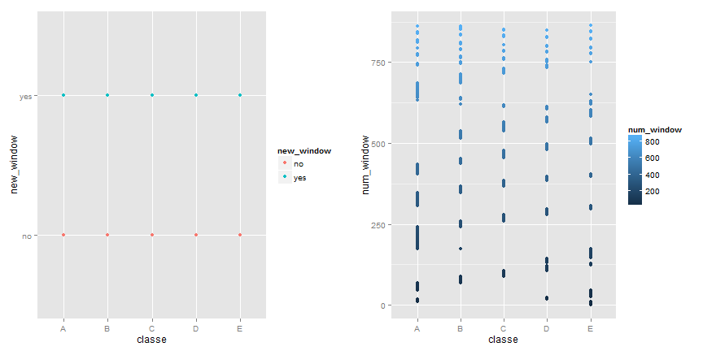
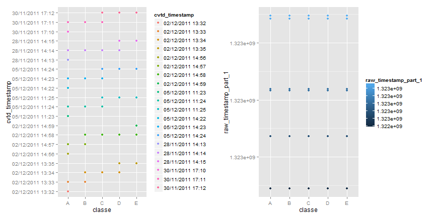

# Title: Predict the exercise manner using Random Forest module

## 1. Introduction.
Using devices such as Jawbone Up, Nike FuelBand, and Fitbit it is now possible to collect a large amount of data about personal activity relatively inexpensively. These type of devices are part of the quantified self movement– a group of enthusiasts who take measurements about themselves regularly to improve their health, to find patterns in their behavior, or because they are tech geeks. One thing that people regularly do is quantify how much of a particular activity they do, but they rarely quantify how well they do it.

The subjects were asked to perform barbell lifts correctly and incorrectly in 5 different ways. More information is available from the website here: http://groupware.les.inf.puc-rio.br/har (see the section on the Weight Lifting Exercise Dataset).

In this project, the goal is to predict the manner in which they did the exercise using data from accelerometers on the belt, forearm, arm, and dumbell of 6 participants.


## 2. Data Processing.

### 2.1 Download and read the datasets into R.

```r
# This report is published in http://rpubs.com/tonyha88/
#setwd("F:\\Coursera\\Practical Machine Learning -by Jeff Leek (JHopkin)\\PA")
# set up the internet
opts_knit$set(width=90)
setInternet2(TRUE)

# download the training dataset from the url provide
url1 <- "https://d396qusza40orc.cloudfront.net/predmachlearn/pml-training.csv"
download.file(url1, "pml_training.csv")

# download the test dataset from the url provide
url2 <- "https://d396qusza40orc.cloudfront.net/predmachlearn/pml-testing.csv"
download.file(url2, "pml_testing.csv")

# read training and test data sets
trainRawData <- read.csv("pml_training.csv",na.strings=c("NA",""))
dim(trainRawData) #[1] 19622   160
```

```
## [1] 19622   160
```

```r
testRawData <- read.csv("pml_testing.csv",na.strings=c("NA",""))
dim(testRawData)  #[1]  20 160
```

```
## [1]  20 160
```

### 2.2 Explore the data set to find patterns.

```r
head(trainRawData$classe )
```

```
## [1] A A A A A A
## Levels: A B C D E
```

```r
head(trainRawData$user_name)
```

```
## [1] carlitos carlitos carlitos carlitos carlitos carlitos
## Levels: adelmo carlitos charles eurico jeremy pedro
```

```r
#View(trainRawData)
#names(trainRawData)
```
After viewing the data set, one notice that there are a lot of NAs in some columns of the data set, which need to remove.


```r
# discard columns contains a lot of NAs in the training set
NAs <- apply(trainRawData,2,function(x) {sum(is.na(x))})
tidyData <- trainRawData[,which(NAs == 0)]
dim(tidyData) #[1] 19622    60
```

```
## [1] 19622    60
```

```r
# discard columns contains a lot of NAs in the test set
NAs <- apply(testRawData,2,function(x) {sum(is.na(x))})
testData <- testRawData[,which(NAs == 0)]
dim(testData) #[1] 20 60
```

```
## [1] 20 60
```

```r
# explore highly structure patterns in the data set
library(ggplot2)
library(gridExtra)
```

```
## Loading required package: grid
```

```r
plot1 <- qplot(classe, new_window, data=tidyData, color=new_window)
plot2 <- qplot(classe, num_window, data=tidyData, color=num_window)
grid.arrange(plot1, plot2, ncol=2)
```

 

```r
plot1 <- qplot(classe, cvtd_timestamp, data=tidyData, , color=cvtd_timestamp)
plot2 <- qplot(classe, raw_timestamp_part_1, data=tidyData, , color=raw_timestamp_part_1)
grid.arrange(plot1, plot2, ncol=2)
```

 

From the above plots, one can see these variables have a very structure patterns related to the "classe" variable, which implies they are highly correlated with "classe" variable in some way, they are potential "confounding" variables, and they are very unlikely generated directly from activity monitors, so we do not want to use these vaiables to build the model to predict the manner in which they did the exercise.


```r
# discards unuseful and potential confounding variables in the training set.
removeIndex <- grep("timestamp|X|user_name|new_window|num_window",names(tidyData))
tidyData <- tidyData[,-removeIndex]
dim(tidyData) #[1] 19622    53
```

```
## [1] 19622    53
```

```r
# discards unuseful and potential confounding variables in the test set.
removeIndex <- grep("timestamp|X|user_name|new_window|num_window",names(testData))
testData <- testData[,-removeIndex]
dim(testData) #[1] 20 53
```

```
## [1] 20 53
```

### 2.3 Explore difference turning parameters to build Random Forest model.

I have choose to use "random forests" from the "caret" package to build the model, because it is one of the top performing algorithm in prediction contests, it is easy to use, it also can handle a lot of predictor variables without resorting to use CPA to reduce the numbers of variables first.

To reduce the CPU time for building the predict model, I have enabled "Parallel Processing" by install "foreach",
"Parallel" and "doParallel" packages, which are needed for the Windows OS. I also choose "cv" (cross-validation) resampling method, which reduces the CPU time substantially. See reference [2] for more information about "Parallel Processing".

I explored cross-validation resampling method with differnce K-fold (4, 8, 15), differnece training data size (20%, 50% or 70% of the tidydata set), and difference "mtry" number to train the random forest model, to find out which combination yield optimum model in term of accuracy, performing, traing data sise, and CPU time. See reference [3] for more information about model turning.


```r
# create training set.
library(caret)
```

```
## Loading required package: lattice
```

```r
#trainIndex <- createDataPartition(y = tidyData$classe, p=0.8,list=FALSE) # 15699 rows
#trainIndex <- createDataPartition(y = tidyData$classe, p=0.5,list=FALSE) # 9812 rows Accuracy=0.991
trainIndex <- createDataPartition(y = tidyData$classe, p=0.7,list=FALSE)  # 13737 rows Accuracy=0.994,number=15;
trainData <- tidyData[trainIndex,]
dim(trainData)
```

```
## [1] 13737    53
```

```r
# create validation data set.
validateData <- tidyData[-trainIndex,]
dim(validateData)
```

```
## [1] 5885   53
```

```r
# enable the following packages to do parallel processing in Window.
library(foreach)
library(parallel)
library(doParallel)
```

```
## Loading required package: iterators
```

```r
coreNumber<-(detectCores()-1)
cluster <-makeCluster(coreNumber, type = "SOCK",outfile="")
registerDoParallel(cluster)
#registerDoParallel(6)
#getDoParWorkers()
```

### 2.4 Build Random Forest model.


```r
set.seed(1234)
tControl = trainControl(method = "cv", number = 15)
#tuneGrid = data.frame(.mtry = seq(2,30,2))
tuneGrid = data.frame(.mtry = seq(4,8,1))
system.time(rf8 <- train(trainData$classe ~.,data = trainData, method="rf", trControl=tControl, tuneGrid=tuneGrid, allowParallel=T))
```

```
## Loading required package: randomForest
## randomForest 4.6-7
## Type rfNews() to see new features/changes/bug fixes.
```

```
##    user  system elapsed 
##   40.06    0.54  597.87
```

```r
stopCluster(cluster)
rf8
```

```
## Random Forest 
## 
## 13737 samples
##    52 predictors
##     5 classes: 'A', 'B', 'C', 'D', 'E' 
## 
## No pre-processing
## Resampling: Cross-Validated (15 fold) 
## 
## Summary of sample sizes: 12822, 12821, 12821, 12822, 12822, 12821, ... 
## 
## Resampling results across tuning parameters:
## 
##   mtry  Accuracy  Kappa  Accuracy SD  Kappa SD
##   4     1         1      0.002        0.003   
##   5     1         1      0.002        0.003   
##   6     1         1      0.002        0.003   
##   7     1         1      0.002        0.002   
##   8     1         1      0.002        0.002   
## 
## Accuracy was used to select the optimal model using  the largest value.
## The final value used for the model was mtry = 7.
```

### 2.5 Out of sample error.
From the model "rf8" output, one can see the accuracy of the model is 1 (i.e 100%) or 0.994 (99.45), it differ slightly between runs (even the set.seed command is used), hence the "in sample error" is 0.0 or 0.006 (0.6%). One can expect the "out of sample error" will also be very small, in the range of 0% to 1.6%, because the model was build using 15 K-fold cross-validation re-sampling method and a lot of observation data (13737). The prediction on the validate data set has confirm this expectation (refer to below).


```r
# predict the validate data
pred <- predict(rf8,validateData); predTrainRight <- pred==validateData$classe
table(pred,predTrainRight)
```

```
##     predTrainRight
## pred FALSE TRUE
##    A     4 1673
##    B     9 1129
##    C    19 1017
##    D     1  954
##    E     1 1078
```

```r
length(predTrainRight[predTrainRight==TRUE]) / length(predTrainRight);
```

```
## [1] 0.9942
```
From the above ouput, the "out of sample error" on the validate data set is 0.6%

### 2.6 Predict the test cases.


```r
# predict the test data
testPred <- predict(rf8,testData)
testPred
```

```
##  [1] B A B A A E D B A A B C B A E E A B B B
## Levels: A B C D E
```
The predict on test test data is 100% according to the course project submission results.

## 3. Results.

The final random forest model was build with ntree=500 (default), mtry = 8, with 13737 rows of observation data (70% of the given traing data set), with 15 K-fold cross-validation re-sampling method, it took about 10 minutes CPU time on a 8 cores Window 8.1 PC. The accuracy of the model is very high 99.4% or 100%, and out of sample error on the validate data set is only 0.6% on the validation set (has 5885 cases), and 100% on the test set (has 20 cases).

## 4. References

[1] Human Activity Recognition: 
URL: http://groupware.les.inf.puc-rio.br/har.

[2] parallel processing:
URL: http://caret.r-forge.r-project.org/parallel.html

[3] Model Training and Parameter Tuning:
URL: http://caret.r-forge.r-project.org/training.html


